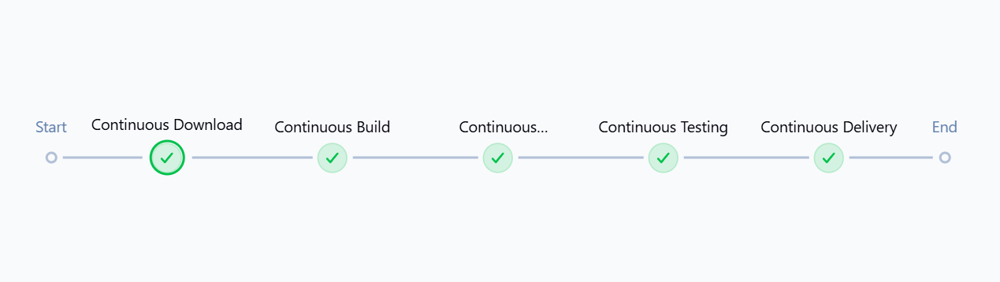

# Jenkins CI/CD Simple Java Web App

This project demonstrates a full Jenkins CI/CD pipeline for a Java web application.

## 🔧 Technologies Used
- Java
- Maven
- Jenkins
- Git
- Tomcat
- Selenium (via JAR test)

## 🚀 Pipeline Stages

1. **Continuous Download**: Clones the latest code from GitHub.
2. **Continuous Build**: Builds the Java web app using Maven.
3. **Continuous Deployment**: Deploys the `.war` to the test server.
4. **Continuous Testing**: Runs automated Selenium tests.
5. **Continuous Delivery**: Deploys the final `.war` to production.

## 🌐 Servers

- **Test Server**
- **Production Server**

## 📸 Jenkins Pipeline Screenshot

Here’s the Stage View from Jenkins:

## 💡 How to Run
1. Make sure Jenkins has Maven + JDK installed.
2. Configure pipeline with your GitHub repo + Jenkinsfile.
3. Ensure SSH access to Tomcat servers.

## 🤖 Author
Arjun Vinod

